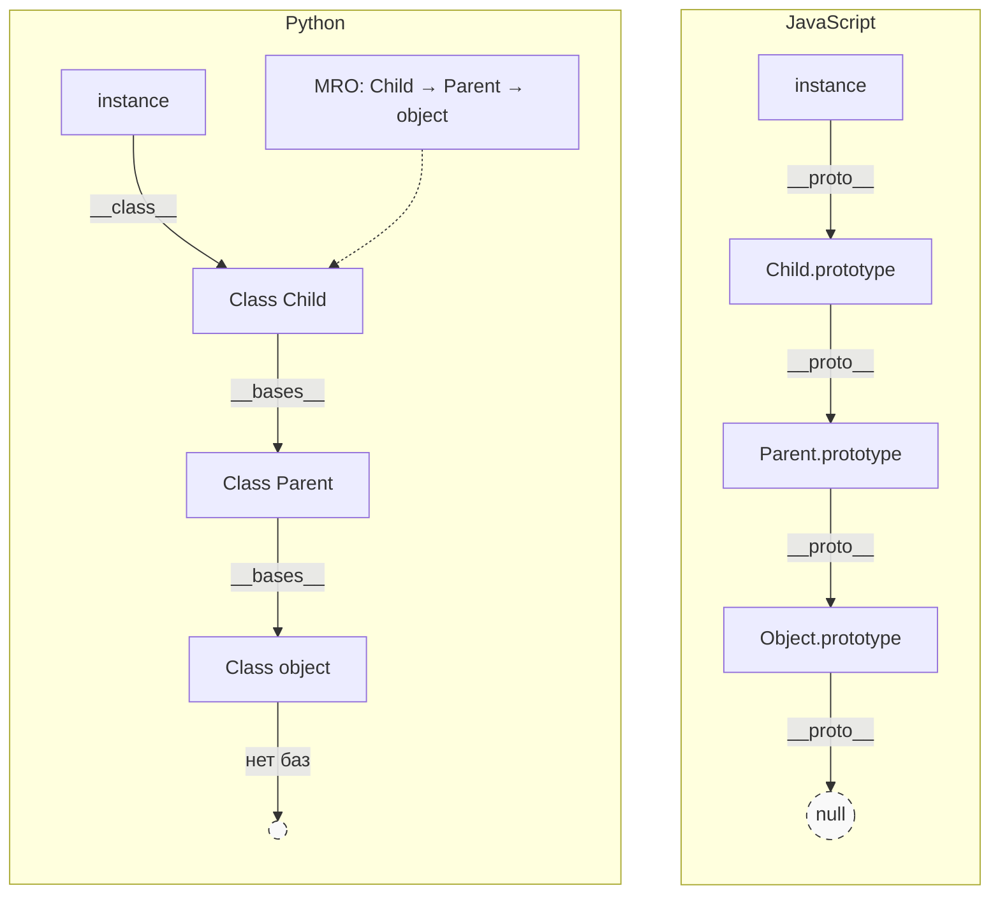

### USER
а можешь графически показать как обьекты наследуются в javascript по цепочке от prototype и как наследуются в python от object?

### ASSISTANT
Вот схематичное сравнение механизмов наследования в JavaScript и Python. Я сгенерировал для вас наглядную диаграмму, а ниже добавил текстовую версию с пояснениями, чтобы исключить возможные искажения текста при генерации.


На изображении выше представлена общая схема, но, как это часто бывает с генерацией, в текстах могли возникнуть небольшие опечатки. Для точности я приведу ниже **исправленную текстовую схему** и подробное пояснение того, что именно происходит «под капотом» в каждом языке.

### 🖼 Схематичное сравнение (Текстовый вариант)



---

### 🔍 Разбор JavaScript: Прототипная цепочка
В JavaScript **нет классов** (в традиционном смысле), есть только объекты. Наследование реализуется через **делегирование**.

1.  **`instance`** — это созданный объект. У него есть скрытое свойство `[[Prototype]]` (доступно как `__proto__`), которое указывает на другой объект.
2.  **`Child.prototype`** — объект, на который указывает `__proto__` экземпляра. Здесь хранятся методы, общие для всех экземпляров `Child`.
3.  **Цепочка:** Если свойство не найдено в самом объекте, JS идёт по `__proto__` → находит `Child.prototype` → если нет, идёт дальше → `Parent.prototype` → `Object.prototype`.
4.  **Конец цепочки:** `Object.prototype.__proto__` равен **`null`**. Это сигнал для движка остановить поиск.

**Код-пример:**
```javascript
class Parent {}
class Child extends Parent {}
const instance = new Child();

console.log(instance.__proto__ === Child.prototype);       // true
console.log(Child.prototype.__proto__ === Parent.prototype); // true
console.log(Parent.prototype.__proto__ === Object.prototype); // true
console.log(Object.prototype.__proto__ === null);          // true
```

---

### 🐍 Разбор Python: Наследование от `object`
В Python всё является объектом, но наследование строится через **иерархию классов**.

1.  **`instance`** ссылается на свой класс через атрибут `__class__` (или функцию `type()`).
2.  **`Class Child`** хранит список базовых классов в атрибуте `__bases__`.
3.  **`object`** — это базовый класс для всех новых классов в Python 3. У него пустой `__bases__`.
4.  **MRO (Method Resolution Order):** Python не просто идёт «вверх» по цепочке. Он строит линейный порядок поиска методов (алгоритм C3), чтобы корректно работать с множественным наследованием. Порядок можно посмотреть через `ClassName.mro()`.

**Код-пример:**
```python
class Parent: pass
class Child(Parent): pass

instance = Child()

print(instance.__class__ is Child)          # True
print(Child.__bases__ == (Parent,))         # True
print(Parent.__bases__ == (object,))        # True
print(Child.mro())                          # [<class '__main__.Child'>, <class '__main__.Parent'>, <class 'object'>]
```

### ⚡ Главное отличие
| Характеристика | JavaScript | Python |
| :--- | :--- | :--- |
| **Механизм** | Делегирование между **объектами** | Иерархия **классов** |
| **Связь** | `instance.__proto__` → `prototype object` | `instance.__class__` → `class` |
| **Поиск метода** | Динамический проход по цепочке ссылок | Предвычисленный список (MRO) |
| **Конец цепочки** | `null` | `object` (который не имеет баз) |

Если нужно, могу показать, как работает множественное наследование (ромбовидное) в Python через MRO или как эмулировать классы в старом JS через функции-конструкторы.